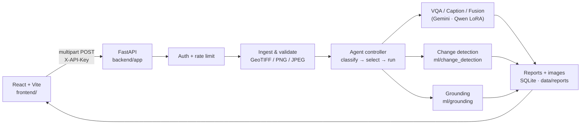

<div align="center">

# 🛰️ SatQuery AI

**Agentic vision-language assistant for multi-modal remote-sensing imagery**

Ask natural-language questions about Sentinel-2 optical and SAR satellite imagery —
single-image VQA, captioning, text-guided grounding, cross-modal fusion, and
bi-temporal change detection — through one API and one chat-style web app.

[](https://github.com/Jalwaysontop/SatQuery/actions/workflows/ci.yml)


[](LICENSE)

</div>

---

## Table of contents

- [Overview](#overview)
- [Features](#features)
- [Architecture](#architecture)
- [Repository structure](#repository-structure)
- [Quick start](#quick-start)
- [Configuration](#configuration)
- [API at a glance](#api-at-a-glance)
- [Testing](#testing)
- [Models & data](#models--data)
- [Documentation](#documentation)
- [Contributing](#contributing)
- [Security](#security)
- [License](#license)

## Overview

SatQuery AI was built for **ISRO/SAC problem statement 26167**. A user uploads
one or more satellite scenes (optical Sentinel-2 band GeoTIFFs, SAR VV/VH
GeoTIFFs, or plain PNG/JPEG previews) together with a question. A
**rule-based agentic controller** looks at *what* was uploaded and *what* was
asked, routes the request to the right specialist model, and returns an
answer plus quantitative results, rendered overlays, and an auditable
execution report.

## Features

| Task | Input | Engine |
|---|---|---|
| **Single-image VQA** | 1 scene + question | Gemini, or fine-tuned Qwen2.5-VL-3B + LoRA (`VQA_BACKEND=qwen`) |
| **Image captioning** | 1 scene + "describe…" | Gemini |
| **Text-guided grounding** | 1 scene + "find / locate…" | Qwen2.5-VL-3B + grounding LoRA (CUDA) |
| **Cross-modal fusion** | Optical T1 + SAR T1 | Gemini with SAR-physics prompting |
| **Change detection + change-VQA** | T1 + T2 (optical, SAR, or both) | Custom `UnifiedChangeNet` checkpoint + Gemini summary |

Platform features:

- 🔐 API-key auth (constant-time comparison, hashed at rest)
- 🚦 Sliding-window rate limiting — in-process or Redis-backed
- 🧾 Persisted, per-key-isolated execution reports (SQLite, WAL mode)
- 🛡️ Upload validation: size / count / extension limits, co-registration checks
- 🧭 Deterministic, auditable task routing (no hidden LLM planner)
- 🌍 3D globe UI (Three.js), voice input, saved results, and report viewer

## Architecture



A full walk-through of every module, the request lifecycle, and extension
points lives in [`docs/ARCHITECTURE.md`](docs/ARCHITECTURE.md).

## Repository structure

```
SatQuery/
├── backend/                 # FastAPI service (API, agent controller, tools)
│   ├── app/
│   │   ├── agent/           #   task classifier, registry, controller
│   │   ├── routers/         #   /analyze, /reports, /tools, /health
│   │   ├── tools/           #   specialist tools + model bridges
│   │   └── ...              #   config, security, ingest, db, schemas
│   ├── scripts/             # operational scripts (API-key generation)
│   ├── tests/               # pytest suite
│   ├── .env.example
│   └── requirements.txt
├── frontend/                # React 19 + TypeScript + Vite + Tailwind web app
│   ├── public/              #   static assets (earth textures, icons)
│   └── src/                 #   components, pages, context, hooks, utils
├── ml/                      # Research / model code consumed by the backend
│   ├── change_detection/    #   UnifiedChangeNet, imaging, Gemini change-VQA
│   │   └── samples/         #     sample Sentinel-2 T1/T2 tiles (13 bands)
│   ├── vqa/                 #   Qwen2.5-VL VQA fine-tuning notebooks + inference
│   └── grounding/           #   Qwen2.5-VL grounding notebook + inference
├── models/                  # Model artifacts (adapters, checkpoints)
│   ├── change-detection/    #   unified_changenet_best.pt   (not in git)
│   ├── vqa-lora/            #   VQA LoRA adapter            (weights not in git)
│   └── grounding-lora/      #   grounding LoRA adapter      (Git LFS)
├── docs/                    # Architecture & design documentation
├── .github/                 # CI workflows, issue / PR templates, Dependabot
├── Makefile                 # Common developer tasks
├── LICENSE                  # MIT
├── CONTRIBUTING.md · SECURITY.md · CODE_OF_CONDUCT.md · CHANGELOG.md
└── package.json             # Workspace scripts that proxy to frontend/
```

Every top-level directory has its own `README.md` with details.

## Quick start

### Prerequisites

| Tool | Version | Notes |
|---|---|---|
| Python | 3.11+ (3.13 tested) | Backend + ML code |
| Node.js | 22+ | Frontend (Vite 8) |
| Git LFS | any | Pulls the grounding adapter weights |
| Redis | optional | Multi-worker rate limiting |
| CUDA GPU | optional | Required only for text-guided grounding |

### 1. Clone

```bash
git lfs install
git clone https://github.com/Jalwaysontop/SatQuery.git
cd SatQuery
```

Place the change-detection checkpoint at
`models/change-detection/unified_changenet_best.pt` (see
[`models/README.md`](models/README.md)).

### 2. Backend

```bash
python3 -m venv .venv && source .venv/bin/activate
pip install -r backend/requirements.txt
cp backend/.env.example backend/.env      # set GEMINI_API_KEY at minimum

cd backend
uvicorn app.main:app --reload --port 8000
```

API docs: <http://127.0.0.1:8000/docs>

### 3. Frontend

```bash
cd frontend
npm ci
cp .env.example .env.local                # optional: point at a non-default backend
npm run dev
```

App: <http://localhost:5173>

Or use the Makefile from the repo root: `make install`, `make backend`,
`make frontend`, `make test` (run `make help` for the full list).

## Configuration

All backend settings are environment variables (or `backend/.env`), read in
one place: [`backend/app/config.py`](backend/app/config.py).

| Variable | Default | Purpose |
|---|---|---|
| `ENVIRONMENT` | `development` | `production` makes `BACKEND_API_KEY` mandatory |
| `BACKEND_API_KEY` | — | Shared secret clients send as `X-API-Key` |
| `ALLOW_NO_AUTH_IN_DEV` | `true` | Allow keyless requests in development |
| `GEMINI_API_KEY` | — | Required for all Gemini-backed tools |
| `GEMINI_TEXT_MODEL` | `gemini-3.8-flash` | Gemini model id |
| `VQA_BACKEND` | `gemini` | `gemini` or `qwen` |
| `CHANGE_CHECKPOINT_PATH` | `models/change-detection/unified_changenet_best.pt` | Change-detection weights |
| `CHANGE_DEVICE` | `cpu` | `cpu` / `cuda` |
| `GROUNDING_ADAPTER_DIR` | `models/grounding-lora` | Grounding LoRA adapter |
| `MAX_UPLOAD_BYTES` / `MAX_FILES_PER_REQUEST` | 25 MB / 64 | Upload limits |
| `RATE_LIMIT_REQUESTS` / `RATE_LIMIT_WINDOW_SECONDS` | 20 / 60 | Per-key rate limit |
| `REDIS_URL` | — | Enables Redis-backed rate limiting |
| `CORS_ALLOW_ORIGINS` | `http://localhost:3000,http://localhost:5173` | Allowed browser origins |

Frontend (`frontend/.env.local`): `VITE_API_BASE_URL` (default
`http://127.0.0.1:8000`) and `VITE_API_KEY`.

## API at a glance

| Method | Route | Auth | Description |
|---|---|---|---|
| `GET` | `/health` | — | Liveness probe |
| `POST` | `/api/v1/analyze` | ✅ | Agentic entry point (query + file groups) |
| `GET` | `/api/v1/reports` | ✅ | Paginated execution history |
| `GET` | `/api/v1/reports/{id}` | ✅ | One execution report |
| `GET` | `/api/v1/reports/{id}/images/{name}` | ✅ | Rendered overlay / confidence map |
| `GET` | `/api/v1/tools` | ✅ | Tool capabilities + live status |

Upload field names — `optical_t1_files`, `optical_t2_files`, `sar_t1_files`,
`sar_t2_files` — decide which task runs. See
[`backend/README.md`](backend/README.md#example-request) for a full example.

## Testing

```bash
make test            # backend pytest + frontend lint & build
# or individually
cd backend && pytest -v
cd frontend && npm run lint && npm run build
```

The backend suite needs no network access or `GEMINI_API_KEY`. The
change-detection integration tests run the real checkpoint against the
sample tiles in `ml/change_detection/samples/`. CI skips those tests because
the checkpoint isn't in git.

## Models & data

| Artifact | Location | In git? |
|---|---|---|
| UnifiedChangeNet checkpoint | `models/change-detection/unified_changenet_best.pt` | ❌ (40 MB, share out of band) |
| VQA LoRA adapter (Qwen2.5-VL-3B, r=16) | `models/vqa-lora/` | configs ✅ · weights ❌ (142 MB) |
| Grounding LoRA adapter (Qwen2.5-VL-3B, r=16) | `models/grounding-lora/` | ✅ via Git LFS |
| Sample Sentinel-2 tiles (T1 2016 / T2 2017) | `ml/change_detection/samples/` | ✅ |

## Documentation

- [`docs/ARCHITECTURE.md`](docs/ARCHITECTURE.md) — backend internals & extension points
- [`backend/README.md`](backend/README.md) — running and testing the API
- [`frontend/README.md`](frontend/README.md) — web app structure and scripts
- [`ml/README.md`](ml/README.md) — model code, notebooks, and training notes
- [`models/README.md`](models/README.md) — obtaining and placing model artifacts
- [`CHANGELOG.md`](CHANGELOG.md) — notable changes

## Contributing

Contributions are welcome. Read [`CONTRIBUTING.md`](CONTRIBUTING.md) for the
branch/commit conventions and the pre-PR checklist, and follow the
[Code of Conduct](CODE_OF_CONDUCT.md).

## Security

Please **do not** open public issues for vulnerabilities. See
[`SECURITY.md`](SECURITY.md) for how to report them privately.

## License

Released under the [MIT License](LICENSE).
