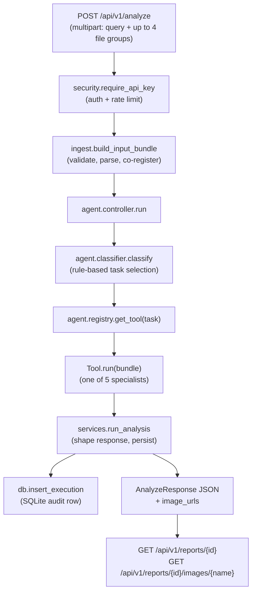

# SatQuery Backend — Implementation Reference

This document explains how the backend is actually built: every module, why
it exists, how a request flows through the system end to end, and where the
extension points are. It's meant as a reference for planning further work
(new tools, new routes, swapping model backends), not a tutorial — read
`backend/README.md` first if you just want to run the service.

The backend is a FastAPI service that wraps the repo's pre-existing ML code
(`vqa_and_change_using_gemini/`, `VQA/`, `Bounding_Box/`) behind an HTTP API
with upload validation, a rule-based agentic task controller, auth/rate
limiting, and auditable execution reports.

## 1. Request lifecycle, end to end



Every request is stateless and self-contained: the client resends all
relevant imagery on every call (there is no server-side "conversation" or
session — the frontend's multi-turn chat UI is a client-side convenience
that re-POSTs the same files each turn). The only persistent state is the
SQLite `executions` table, written once per completed (or failed) run.

## 2. Directory map

```
backend/app/
├── main.py            # FastAPI app, middleware, global exception handlers
├── config.py           # Settings (env/.env), the only place reading os.getenv
├── security.py         # API-key auth + rate-limit dependency
├── rate_limiter.py      # In-process and Redis sliding-window limiters
├── ingest.py            # Multipart upload -> validated InputBundle
├── sar_ingest.py        # SAR (VV/VH) GeoTIFF band loading
├── types.py             # InputBundle / SceneImage (internal dataclasses)
├── schemas.py           # Pydantic response DTOs (the public API contract)
├── exceptions.py        # SatQueryError hierarchy -> HTTP status mapping
├── db.py                 # SQLite execution-record persistence
├── services.py           # Orchestration glue: ingest -> agent -> response
├── ml_paths.py            # sys.path shim so repo-root ML modules import cleanly
├── agent/
│   ├── classifier.py     # Deterministic task classification
│   ├── registry.py       # TaskType -> Tool lookup table
│   └── controller.py     # classify -> select -> execute -> summarize
├── tools/
│   ├── base.py            # Tool ABC + ToolResult contract
│   ├── vqa_tool.py         # single_image_vqa
│   ├── caption_tool.py     # single_image_captioning
│   ├── change_tool.py      # change_vqa (bi-temporal)
│   ├── fusion_tool.py      # cross_modal_fusion (same-time optical+SAR)
│   ├── grounding_tool.py   # text_guided_grounding
│   ├── gemini_client.py    # Shared Gemini call + retry/error-mapping
│   ├── qwen_client.py      # Bridge to VQA/inference.py (Qwen2.5-VL + LoRA)
│   ├── grounding_client.py # Bridge to satquery_grounding_inference.py
│   └── render.py           # Change-mask overlay drawing (matplotlib)
└── routers/
    ├── analyze.py         # POST /api/v1/analyze
    ├── reports.py          # GET /api/v1/reports, /{id}, /{id}/images/{name}
    ├── capabilities.py     # GET /api/v1/tools
    └── health.py           # GET /health (unauthenticated)
```

## 3. `main.py` — application bootstrap

- Creates the `FastAPI` app, runs `init_db()` in the `lifespan` startup hook.
- CORS is configured from `Settings.cors_origins_list`
  (`CORS_ALLOW_ORIGINS` env var — must include the frontend's dev origin,
  `http://localhost:5173` by default).
- Two global exception handlers:
  - `SatQueryError` → structured JSON (`error`, `message`, `details`,
    `request_id`) at the exception's own `status_code`.
  - Any other unhandled `Exception` → generic 500, full traceback logged
    server-side only (never leaked to the client).
- Routers are mounted in `routers/__init__` order; every route except
  `/health` depends on `security.require_api_key`.

## 4. `config.py` — settings

A single `pydantic_settings.BaseSettings` subclass, `Settings`, read once
via `get_settings()` (`@lru_cache`d — settings are fixed for the process
lifetime; tests call `get_settings.cache_clear()` to override). Nothing
else in the codebase calls `os.getenv()` directly.

Notable fields and what they gate:

| Field | Default | Effect |
|---|---|---|
| `backend_api_key` | unset | If unset + `allow_no_auth_in_dev` + non-production → requests need no `X-API-Key`. Otherwise required. |
| `gemini_api_key` | unset | Required by every Gemini-backed tool (caption, fusion, VQA-gemini, change-VQA's text answer). Missing → `UpstreamModelError` (502) from that tool only, not a hard startup failure. |
| `vqa_backend` | `"gemini"` | `"qwen"` switches `single_image_vqa` to the fine-tuned local model (see §7). |
| `grounding_adapter_dir` | `<repo>/latest_adapter` | Weights for `text_guided_grounding`. Requires a CUDA GPU at inference time — no CPU fallback. |
| `change_checkpoint_path` | `<repo>/vqa_and_change_using_gemini/unified_changenet_best.pt` | The one non-optional local model — every `change_vqa` call needs it. |
| `max_upload_bytes` / `max_files_per_request` | 25 MB / 64 | Enforced in `ingest._read_group`. |
| `rate_limit_requests` / `_window_seconds` | 20 / 60 | Per-API-key sliding window. Easy to trip during interactive testing — see §9. |
| `redis_url` | unset | If set, rate limiting is enforced in Redis (correct across workers); otherwise in-process (correct for exactly one worker). |

## 5. `security.py` + `rate_limiter.py` — auth and throttling

`require_api_key` is a FastAPI dependency: it validates `X-API-Key` via
constant-time comparison (`hmac.compare_digest`), then calls
`get_rate_limiter().check(key)`. The limiter is picked once (Redis if
`REDIS_URL` is set, else in-process) and reused for the process lifetime.

Auth model is deliberately single-tier: one shared secret, no user
accounts, no per-user roles — the product spec is a single evaluator-facing
tool. `hash_api_key()` (SHA-256) is used only as the DB scoping column, so
raw keys are never persisted.

The in-process limiter is a plain sliding window over a `deque` per key;
the Redis limiter is the same algorithm implemented as a sorted-set
(`ZADD`/`ZREMRANGEBYSCORE`/`ZCARD`) inside one `MULTI/EXEC` pipeline, and
**fails open** (allows the request) if Redis itself is unreachable —
availability over strictness.

## 6. `ingest.py` + `sar_ingest.py` + `types.py` — turning uploads into a typed bundle

`build_input_bundle(query, optical_t1_files, optical_t2_files, sar_t1_files,
sar_t2_files)` is the only way raw `UploadFile`s become an `InputBundle`.
Steps, per file group:

1. **Read & bound** — file count vs. `max_files_per_request`, per-file size
   vs. `max_upload_bytes`, extension vs. `{.tif, .tiff, .png, .jpg, .jpeg}`.
2. **Parse**:
   - A single PNG/JPEG is treated as an already-rendered preview image
     (`SourceKind.PNG_JPEG`) — allowed only because benchmark datasets don't
     ship as multi-band GeoTIFFs.
   - Optical GeoTIFFs go through `vqa_and_change_using_gemini.pipeline
     .load_optical_bands_from_uploads` (existing, untouched ML code) →
     `(13, H, W)` float32.
   - SAR GeoTIFFs go through `sar_ingest.load_sar_bands_from_uploads`,
     matched by filename regex for `VV`/`VH` → `(2, H, W)` float32.
3. **Co-registration check** — if both optical and SAR are supplied for the
   same timestep, their `(H, W)` must match exactly (the fusion/change model
   crops both modalities on the same pixel grid); mismatch → 422 with both
   shapes in `details`.
4. **Pairing rules** — `optical_t2` without `optical_t1` (or the SAR
   equivalent) is rejected; at least one T1 image (optical or SAR) is
   mandatory.

Every `SceneImage` carries both the raw model-ready `array` and an
`(H, W, 3)` uint8 `rgb_preview` (computed via `optical_to_rgb` /
`sar_to_grayscale_rgb`) — the preview is what every Gemini-backed tool
actually sends as the image payload, and what gets rendered into report
PNGs.

`InputBundle` (in `types.py`) is where the *shape* of the input is
expressed as properties (`has_bitemporal`, `is_single_time_cross_modal`,
`single_image`) — the classifier reads these, never the raw fields
directly.

## 7. Agent layer — orchestration

This is the "agentic controller" the product spec asks for. It is
**deliberately not an LLM planning loop** — see the docstring in
`classifier.py`: task selection must be auditable and reproducible, so it's
a straight `classify → select → execute → summarize` pipeline with no
hidden model call deciding the route.

**`agent/classifier.py`** — `classify(bundle) -> TaskType`, driven primarily
by *which images were supplied*, with query keywords resolving the one
remaining ambiguity (VQA vs. captioning vs. grounding for a single image):

| Input shape | Query pattern | → Task |
|---|---|---|
| Bi-temporal (optical T1+T2, and/or SAR T1+T2) | — | `change_vqa` (fusion mode if both modalities' pairs are present) |
| Optical T1 + SAR T1, no T2 | — | `cross_modal_fusion` |
| Exactly one single-timestep image | matches grounding verbs (`find`, `locate`, `detect`, `bounding box`, …) and no `?` | `text_guided_grounding` |
| Exactly one single-timestep image | matches caption patterns (`describe`, `caption`, `summarize`, …) and no `?` | `single_image_captioning` |
| Exactly one single-timestep image | anything else (including any question with `?`) | `single_image_vqa` |
| None of the above | — | `ValidationFailed` (422) |

Grounding patterns are checked *before* captioning patterns so "find the
airport" isn't mistaken for a description request. A query ending in `?`
always falls through to VQA even if it contains a caption/grounding
keyword, on the theory that a question wants an answer, not a bare caption
or box list.

**`agent/registry.py`** — a `dict[TaskType, Tool]` built at import time from
the five concrete tool classes. `get_tool(task)` is the only lookup the
controller uses; `list_tools()` (backing `GET /api/v1/tools`) additionally
computes a live `status` string per tool — e.g. `change_vqa` reports
`"degraded (GEMINI_API_KEY unset: ...)"` when the key is missing, and
`text_guided_grounding` reports whether the adapter directory actually
exists on disk. **This endpoint is not currently called by the frontend** —
it's a good candidate for a capabilities/status panel (see §10).

**`agent/controller.py`** — `run(bundle) -> AgentRunResult`. Three lines of
actual orchestration (`classify` → `get_tool` → `tool.run`), wrapped with
timing and two summarization helpers:
- `_models_used(result)` reads `ToolResult.parameters` for `checkpoint`,
  `model`, or `vqa_model` keys — this is how the "models_used" list in the
  API response and audit trail is derived, not a separate registry.
- `_input_summary(bundle)` describes each supplied image's modality,
  source kind, and shape — this becomes `execution_summary.input_summary`.

## 8. Tools — the specialist registry

Every tool implements `tools/base.py`'s `Tool` ABC: a `name`,
`description`, `requires` (human-readable precondition, shown in
`/api/v1/tools`), `domain_adapted` flag, and one method, `run(bundle) ->
ToolResult`. `ToolResult` is the tool's entire contract back to the
controller: `answer`, `confidence`, `change_percentage`, `regions`,
`images` (name → raw PNG bytes, persisted by `services.py`), `parameters`
(free-form, becomes both `models_used` derivation input and the audit
row's `parameters` column), and `warnings` (surfaced verbatim to the
client — e.g. "GEMINI_API_KEY not configured, quantitative results only").

| Tool | Task | Backend(s) | Domain-adapted? |
|---|---|---|---|
| `SingleImageVqaTool` | `single_image_vqa` | `VQA_BACKEND=gemini` (generic prompt) or `qwen` (fine-tuned Qwen2.5-VL-3B + LoRA, see `VQA/inference.py`) | Only when `qwen` |
| `CaptioningTool` | `single_image_captioning` | Gemini only | No |
| `ChangeVqaTool` | `change_vqa` | Local `unified_changenet_best.pt` (optical/SAR/fusion modes) for the quantitative result + Gemini for the natural-language answer | Yes (the checkpoint) |
| `CrossModalFusionTool` | `cross_modal_fusion` | Gemini, prompted with both previews + SAR-physics framing | No |
| `TextGuidedGroundingTool` | `text_guided_grounding` | Qwen2.5-VL-3B + grounding LoRA (`latest_adapter/`), CUDA-only | Yes |

**`ChangeVqaTool`** (`change_tool.py`) is the most involved: it runs the
local torch checkpoint synchronously (`ChangeDetector.predict`, lazily
loaded once per process behind a lock in `get_detector()`), producing
`change_percentage`, per-region boxes with confidence, a confidence-map
PNG, and an overlay PNG (`render.py`, matplotlib-based, works for both
optical and SAR-only previews) — none of that needs Gemini. It *then*
separately asks Gemini for a natural-language summary
(`_ask_gemini_about_change`): the optical+optical case reuses the existing
`vqa_and_change_using_gemini.vqa.ask_change_vqa` prompt; the SAR-only case
(not covered by that existing helper) builds its own modality-agnostic
prompt here. If the Gemini call fails for any reason, the tool does **not**
fail the whole request — it appends a warning and returns the quantitative
result with `answer=None`. This is why you'll see `"GEMINI_API_KEY not
configured: returning quantitative change results only"` as a *warning*,
not an error, in the API response.

**`qwen_client.py`** / **`grounding_client.py`** both defer their `import`
of the actual inference module (and the model load it triggers) into an
`@lru_cache`d function, specifically so a server running with
`VQA_BACKEND=gemini` (or never calling grounding) never pays the cost of
loading a ~3B-parameter model. First call after startup is therefore slow
(model load + possible weight download — see §9); subsequent calls reuse
the cached module/predictor.

**Adding a new tool**: implement `Tool`, register it in
`agent/registry.py`'s `_REGISTRY` dict keyed by a `TaskType`, and add a
branch to `agent/classifier.py` if it needs new routing logic. Nothing else
in the pipeline needs to change — the controller, services layer, and API
schema are all tool-agnostic.

## 9. `services.py` — response shaping and persistence

`run_analysis(bundle, api_key_hash)` is the seam between the agent layer's
internal types (`ToolResult`) and the public API (`AnalyzeResponse`):

1. Generates a fresh `execution_id` (UUID4) — this is the only identifier
   used across the report/image endpoints; it is *not* derived from
   anything in the request.
2. Persists any `ToolResult.images` to
   `data/reports/{execution_id}/{name}.png` and builds the `image_urls` map
   (`/api/v1/reports/{execution_id}/images/{name}`).
3. Writes one row to the `executions` table via `db.insert_execution` —
   this happens on every *successful* run (task classification or tool
   failures raise before reaching this point and are never persisted; see
   the `status` column, always `"success"` here — there's no `"error"` path
   actually written despite the DB schema allowing for one).
4. Splits `ToolResult.regions` into either `ChangedRegion[]` or
   `GroundedRegion[]` on the response based on whether the task was
   `GROUNDING` — the DB row itself stores the raw region dicts untyped.

## 10. `db.py` — persistence

Plain `sqlite3` (WAL mode), one table (`executions`), one thread-local
connection. Deliberately no ORM — there's exactly one entity to persist and
no other database layer in the repo to be consistent with. Two read paths:
`get_execution(id, api_key_hash)` (used by both `GET /reports/{id}` and the
image-serving route, always scoped to the caller's key) and
`list_executions(api_key_hash, limit, offset)` (the audit-trail listing).

**This is the backing store for the frontend's Saved Results page** — see
`frontend/src/pages/SavedResults.tsx` and `frontend/src/utils/api.ts`'s
`listReports`/`getReport`.

## 11. `schemas.py` — the public contract

Every field a client can see is explicitly whitelisted here — nothing from
`ToolResult` or the DB row is ever returned as-is. Two shapes worth
distinguishing (a real gotcha if you're writing a client against this API):

- **`AnalyzeResponse`** (`POST /analyze`'s return, and `GET
  /reports/{id}`'s conceptual shape) has `regions` *or* `grounded_regions`
  populated depending on task, plus a nested `execution_summary`.
- **The raw `GET /reports/{id}` response is actually the flattened DB row**
  (`id`, `created_at`, `query`, `task`, `models_used`, `parameters`,
  `status`, `answer`, `change_percentage`, `regions` (untyped JSON, not
  split into `regions`/`grounded_regions`), `confidence`, `warnings`,
  `error_message`, `duration_ms`, `image_urls`) — there is **no**
  `execution_summary` wrapper and **no** `report_url` field on this
  response, unlike the `POST /analyze` response. The frontend's
  `ExecutionReport` TypeScript type in `utils/api.ts` documents this
  divergence explicitly because it's easy to get wrong.

## 12. Routers

| Route | Auth | Notes |
|---|---|---|
| `GET /health` | none | Liveness only, no rate limit. |
| `POST /api/v1/analyze` | required | The single agentic entry point. Runs the blocking ML work in a threadpool (`run_in_threadpool`) so it doesn't block the event loop. |
| `GET /api/v1/reports` | required | Paginated (`limit`/`offset`), scoped to the caller's API key. |
| `GET /api/v1/reports/{id}` | required | Flattened DB row + derived `image_urls`. |
| `GET /api/v1/reports/{id}/images/{name}` | required | Path-traversal-hardened (`..`, `/`, `\\` rejected; resolved path double-checked to stay under `reports_dir`). |
| `GET /api/v1/tools` | required | Capability/status listing — see §7. Not yet consumed by the frontend. |

## 13. How the frontend integrates with this (for context)

The frontend (`frontend/src/utils/api.ts`) is a thin typed client over
exactly this API surface:

- `analyzeQuery(query, filesByGroup)` builds the same four-group
  `FormData` shape `analyze.py` expects and posts it.
- Because auth is header-based (`X-API-Key`), result images can't be
  loaded with a plain `` when a key is configured — the frontend
  fetches them as authenticated blobs (`fetchImageAsObjectUrl`) and uses
  object URLs instead.
- The client-side task classifier the UI *doesn't* have: the frontend
  doesn't try to predict `TaskType` — it just gates on "at least one T1
  image attached" (mirroring `ingest.py`'s hard requirement) before ever
  calling the backend, so an obviously-invalid request never leaves the
  browser.

## 14. Known environment gaps (as of this writing)

- **`GEMINI_API_KEY` unset** (default local dev): every Gemini-backed tool
  (caption, fusion, VQA-gemini, change-VQA's text answer) fails with a 502
  `UpstreamModelError`, or — for `change_vqa` specifically — degrades to a
  warning instead of a hard failure (§8). Set it in `backend/.env` to
  exercise these paths.
- **`VQA_BACKEND=qwen`**: on first use, `qwen_client.py` triggers a
  multi-GB download of `Qwen/Qwen2.5-VL-3B-Instruct` from Hugging Face Hub.
  In network-restricted sandboxes, `huggingface_hub`'s default "xet" CDN
  transfer path can silently stall at 0% indefinitely (observed directly
  while testing this integration) even though plain HTTPS works fine for
  the API metadata calls. Workaround: set `HF_HUB_DISABLE_XET=1` in the
  environment before starting the server to force the plain-HTTPS download
  path. Not currently set anywhere in this repo — apply it per-environment
  if you hit a stalled download.
- **`text_guided_grounding`** requires a CUDA GPU at inference time — no
  CPU fallback exists in `satquery_grounding_inference.py`. It will raise
  `UpstreamModelError` on any machine without one, including typical local
  dev laptops.
- **Rate limiting** defaults to 20 requests/60s per API key
  (`RATE_LIMIT_REQUESTS`/`RATE_LIMIT_WINDOW_SECONDS` in `backend/.env`).
  This is easy to trip during interactive UI testing — every open of a
  Saved Results report re-fetches that execution's images fresh (no
  client-side cache), so browsing several reports in under a minute can
  return `429`s on the image requests specifically.

## 15. Extension points, summarized

- **New specialist model/task**: implement `tools/base.Tool`, register in
  `agent/registry.py`, extend `agent/classifier.py`'s routing if the task
  needs new disambiguation logic.
- **New model backend for an existing task** (e.g. a third VQA option):
  follow the `qwen_client.py` pattern — a lazily-imported bridge module,
  gated behind a `Settings` field, branched on inside the tool's `run()`.
- **New upload modality**: extend `types.Modality`, add a loader alongside
  `sar_ingest.py`, wire a new upload-group parameter through
  `ingest.build_input_bundle` and `routers/analyze.py`.
- **Multi-tenant auth**: `security._check_api_key` is the one place doing
  identity resolution today (single shared secret); swapping to per-user
  keys/accounts would replace this function without touching the
  request-handling code that calls it.
